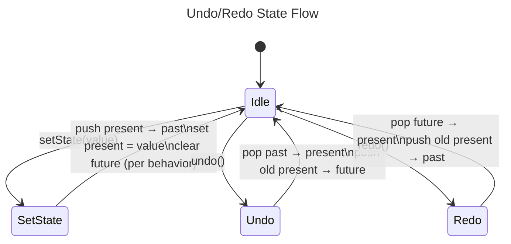
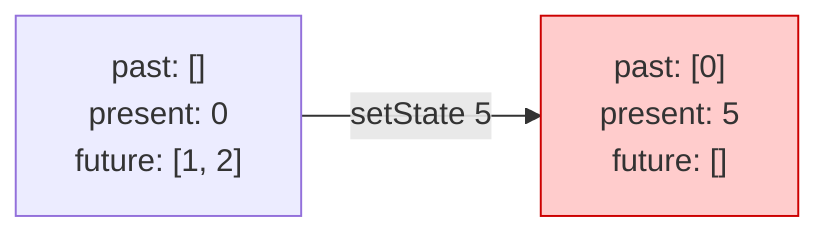
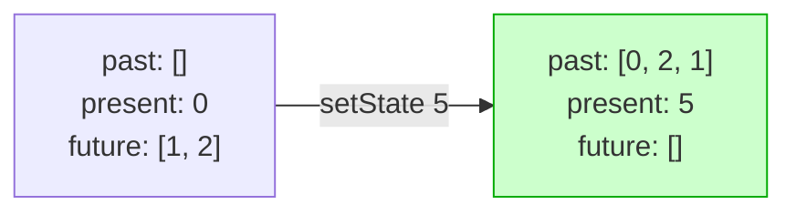
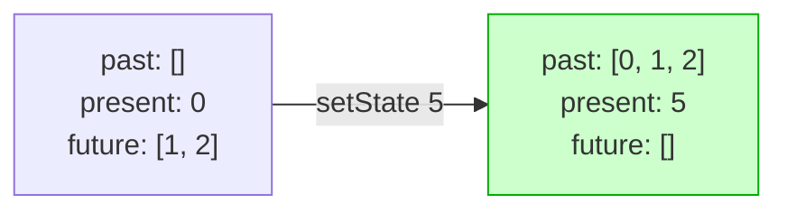
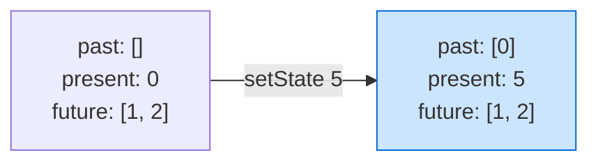

<div align="center">

# use-undoable-next

### Undo/redo for React, without the hassle.

[](https://www.npmjs.com/package/use-undoable-next)
[](https://www.npmjs.com/package/use-undoable-next)
[](./LICENSE)
[](https://react.dev)
[](https://www.typescriptlang.org)
[](https://bundlephobia.com/package/use-undoable-next)

A React hook that adds undo/redo functionality to `useState` with a familiar API,
customizable mutation behaviors, and zero dependencies.

**Topics:** `react` · `react-hook` · `undo` · `redo` · `history` · `state-management` · `typescript`

</div>

---

## Features

| Feature | Description |
|---------|-------------|
| **Familiar API** | Mirrors `useState`; drop-in replacement with undo/redo support |
| **4 mutation behaviors** | `mergePastReversed`, `mergePast`, `destroyFuture`, `keepFuture` |
| **Per-call overrides** | Change behavior on-the-fly for individual `setState` calls |
| **History limit** | Cap memory usage with a configurable `historyLimit` |
| **Functional updaters** | `setState(prev => prev + 1)` works just like `useState` |
| **Zero dependencies** | No bloat; tiny footprint, ships as ESM + CJS |
| **TypeScript native** | Full type safety with generic state inference |

---

## Installation

```bash
npm install use-undoable-next
```

```bash
yarn add use-undoable-next
```

```bash
pnpm add use-undoable-next
```

---

## Quick Start

```tsx
import useUndoable from "use-undoable-next"

function Counter() {
  const [count, setCount, { undo, redo, canUndo, canRedo }] = useUndoable(0)

  return (
    <div>
      <p>{count}</p>
      <button onClick={() => setCount(c => c + 1)}>+</button>
      <button onClick={() => setCount(c => c - 1)}>−</button>
      <button onClick={undo} disabled={!canUndo}>↶ Undo</button>
      <button onClick={redo} disabled={!canRedo}>↷ Redo</button>
    </div>
  )
}
```

---

## How It Works

`useUndoable` maintains three pieces of state internally: a **past** stack, the
**present** value, and a **future** stack. Every `setState` pushes the current
value into `past`. Calling `undo` moves the present into `future` and pops the
last item from `past` into `present`. `redo` does the reverse.



### Visual walkthrough

Starting state:

```
{ past: [],              present: 0,    future: [] }
```

After `setState(1)` → `setState(2)`:

```
{ past: [0, 1],          present: 2,    future: [] }
```

After `undo()`:

```
{ past: [0],             present: 1,    future: [2] }
```

After `undo()` again:

```
{ past: [],              present: 0,    future: [1, 2] }
```

After `redo()`:

```
{ past: [0],             present: 1,    future: [2] }
```

---

## API Reference

### Hook signature

```ts
function useUndoable<T>(
  initialPresent: T,
  options?: Options
): UseUndoable<T>
```

### Return value

The hook returns a tuple `[state, setState, helpers]`:

| Element | Type | Description |
|---------|------|-------------|
| `state` | `T` | The current (present) state value |
| `setState` | `(value \| updater, behavior?, ignoreAction?) => void` | Updater; accepts a value or functional updater, like `useState` |
| `helpers.past` | `T[]` | Array of past state values |
| `helpers.future` | `T[]` | Array of future (redo-able) state values |
| `helpers.undo` | `() => void` | Move one step back in history |
| `helpers.redo` | `() => void` | Move one step forward in history |
| `helpers.canUndo` | `boolean` | Whether undo is available |
| `helpers.canRedo` | `boolean` | Whether redo is available |
| `helpers.reset` | `(newState?) => void` | Wipe history and reset present (defaults to `initialState`) |
| `helpers.resetInitialState` | `(newInitial: T) => void` | Replace the first item in `past`; useful for async data |
| `helpers.static_setState` | `(value, behavior?, ignoreAction?) => void` | Stable setter that never changes identity (value only, no functional updater) |

### `setState` parameters

```ts
setState(
  payload: T | ((prev: T) => T),  // new value or functional updater
  behavior?: MutationBehavior,     // override for this call only
  ignoreAction?: boolean           // if true, skip history tracking
)
```

> **Tip:** To use the global behavior but set `ignoreAction`, pass `null` as the
> second argument: `setState(value, null, true)`

---

## Options

```ts
interface Options {
  behavior?: MutationBehavior
  historyLimit?: number | "infinium" | "infinity"
  ignoreIdenticalMutations?: boolean
  cloneState?: boolean
}
```

| Option | Default | Description |
|--------|---------|-------------|
| `behavior` | `"mergePastReversed"` | How history is treated after a state change following an `undo` |
| `historyLimit` | `100` | Max items in the `past` array. Use `"infinium"` or `"infinity"` for unlimited |
| `ignoreIdenticalMutations` | `true` | Skip recording a state change if the new value equals the current value |
| `cloneState` | `false` | Return a shallow clone instead of the same reference (helps trigger re-renders) |

---

## Mutation Behaviors

The **behavior** determines what happens to the `future` array when you make a
new state change *after* having called `undo`. This is the killer feature:
you're not locked into one strategy.

Starting point for all examples:

```
{ past: [],  present: 0,  future: [1, 2] }
```

Now we call `setState(5)`:

### `destroyFuture`: discard the future



The future is erased. Values `1` and `2` are gone; the user can't get back to them.

### `mergePastReversed` *(default)*: merge future into past (reversed)



The future is reversed and appended to the past. Every state remains reachable via `undo`.

### `mergePast`: merge future into past (as-is)



Same as above, but the future is appended in its original order.

### `keepFuture`: leave the future untouched



The future stays in place. Both `undo` and `redo` remain available.

### Behavior comparison

| Behavior | Future after `setState` | All states reachable? | Use case |
|----------|------------------------|----------------------|----------|
| `destroyFuture` | `[]` | No | Git-style (branch is discarded) |
| `mergePastReversed` | `[]` | Yes | Intuitive undo-then-edit (default) |
| `mergePast` | `[]` | Yes | Same, but preserves future order |
| `keepFuture` | unchanged | Yes | Non-destructive, keeps redo available |

---

## Handling Async Data (`resetInitialState`)

When fetching data from an API, your `initialState` might start as `[]` or
`undefined`. Without `resetInitialState`, users could `undo` all the way back to
that empty state.

```tsx
function TodoList() {
  const [todos, setTodos, { undo, redo, resetInitialState }] = useUndoable([])

  useEffect(() => {
    fetchTodos().then(apiTodos => {
      setTodos(apiTodos)
      resetInitialState(apiTodos) // ← prevents undo back to []
    })
  }, [])

  return /* ... */
}
```

> **Important:** Call `resetInitialState` only once. Calling it multiple times
> on an existing state risks overwriting legitimate history entries.

---

## `static_setState`

The default `setState` changes identity on every state update because it supports
functional updaters (which close over `present`). If this causes issues with
memoized children or effect dependencies, use `static_setState`:

```tsx
const [count, setCount, { static_setState }] = useUndoable(0)

// static_setState accepts a value only (no functional updater)
// its identity never changes across renders
static_setState(42)
```

---

## Renaming Destructured Values

Since the third element is an object, you can rename anything:

```tsx
const [
  count,
  setCount,
  {
    past: history,
    future: upcoming,
    undo: stepBack,
    redo: stepForward,
    canUndo: hasHistory,
    reset: wipe,
  },
] = useUndoable(0)
```

---

## Performance

Every state change stores the previous state in memory. For large state objects,
consider:

1. **Use `historyLimit`** to cap the number of stored past states
2. **Store diffs, not snapshots**; instead of storing the full array, store
   mutation descriptions like `{ index: 5, field: "name", value: "infinium" }`
3. **Use `ignoreIdenticalMutations`** to avoid polluting history with no-op updates

```tsx
// Limit history to 50 entries
const [state, setState] = useUndoable(initialState, {
  historyLimit: 50,
})
```

---

## Integration with React Flow v10

React Flow v10 separates node and edge state. To integrate with `useUndoable`,
make it the **exclusive** state manager for both; don't let React Flow's
internal state fight with the hook.

> **Note:** Dragging a node fires many `onDrag` events, each counted as a
> separate history entry. You may want to debounce or batch these.

See [`react-flow-example/src/App.jsx`](./react-flow-example/src/App.jsx) for a
working integration.

---

## Contributing

```bash
# Clone and install
git clone https://github.com/sujalxplores/useUndoable.git
cd useUndoable
pnpm install

# Build the library (runs automatically on install via prepare)
pnpm build

# Run the demo
cd demo && pnpm install && pnpm start
```

---

## GitHub Repository Setup

Set the repo description and topics (run once):

```bash
# Repository description
gh repo edit sujalxplores/useUndoable \
  --description "React hook for undo/redo functionality with customizable mutation behaviors and zero dependencies."

# Topics for discoverability
gh repo edit sujalxplores/useUndoable \
  --add-topic react \
  --add-topic react-hook \
  --add-topic undo \
  --add-topic redo \
  --add-topic history \
  --add-topic state-management \
  --add-topic typescript \
  --add-topic react19
```

---

## License

[MIT](./LICENSE) © [sujalxplores](https://github.com/sujalxplores)
